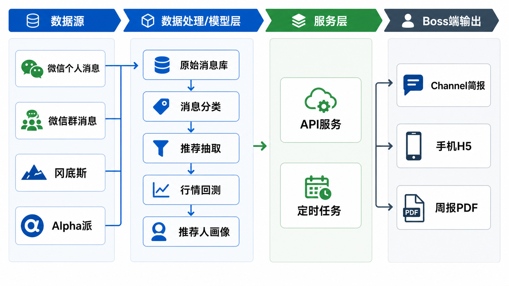
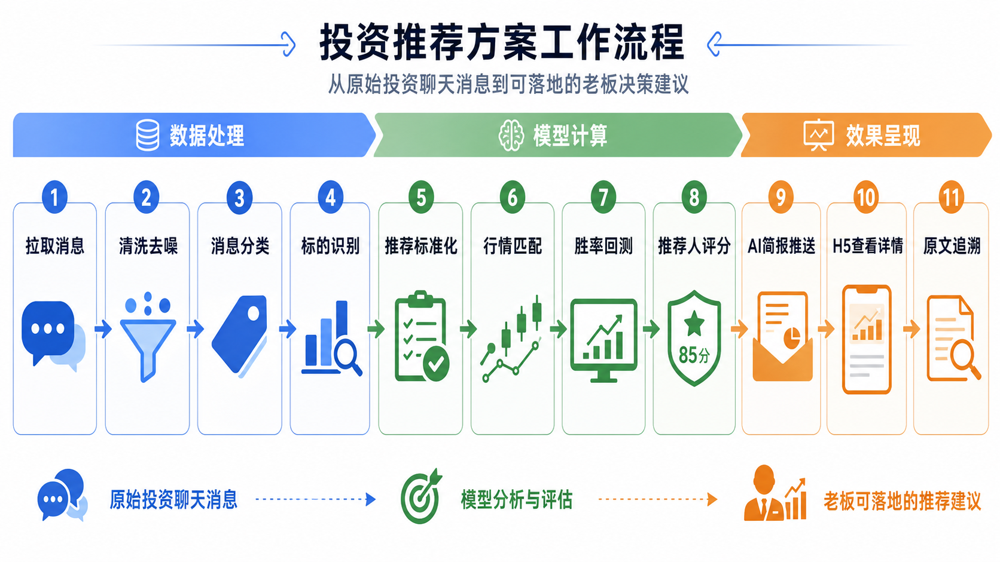
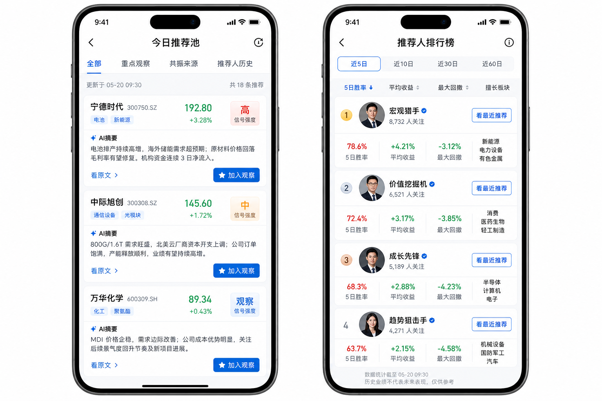

# 投研信息流与判断过程数字化：可落地效果说明

## 1. 这件事解决什么问题

老板每天会收到大量来自微信个人消息、微信群、冈底斯、Alpha 派等渠道的投研信息。这些信息本身有价值，但问题是：

1. 信息太散，分布在不同渠道。
2. 噪声太多，混有活动通知、工具介绍、私人消息。
3. 推荐表达不统一，难以比较。
4. 推荐后有没有效果，缺少系统性验证。
5. 不知道哪些推荐人长期靠谱、擅长什么板块、适合什么周期。

这个系统的目标不是一上来自动交易，也不是简单做股票推荐，而是把老板每天依赖的信息流和判断过程数字化、结构化、可复盘。

这里真正要沉淀的是两类资产：

1. 信息流资产：谁在什么时间、什么渠道、围绕什么标的或主题说了什么。
2. 判断过程资产：老板如何过滤噪声、识别有效推荐、观察观点演变、判断哪些信号值得跟。

核心闭环：

```text
投研消息 -> 信息归类 -> 观点链沉淀 -> 推荐人/主题评价 -> 决策辅助与复盘
```

## 2. 最终交付效果

老板最终看到的不是一堆聊天记录，而是三个日常入口：

1. Channel 每日 AI 简报：主动推送今天值得关注的信息和判断摘要。
2. 手机 H5 今日推荐池：看今天哪些标的/主题值得观察。
3. 手机 H5 推荐人排行榜：看哪些推荐人的信息长期更有参考价值。

周报/月报 PDF 作为复盘材料，不作为日常主入口。

## 3. 总体架构图



架构分四层：

| 层级 | 作用 |
| --- | --- |
| 数据源 | 接入微信个人消息、微信群消息、冈底斯、Alpha 派等 |
| 数据处理/模型层 | 做消息清洗、分类、观点链沉淀、推荐抽取、行情回测、推荐人画像 |
| 服务层 | 提供 API 服务和定时任务 |
| 老板端输出 | Channel 简报、手机 H5、周报 PDF |

## 4. 工作流程图



核心流程：

1. 拉取消息：按时间窗口拉取微信等数据源。
2. 清洗去噪：过滤私人消息、活动通知、无关闲聊。
3. 消息分类：区分有效推荐、研究观点、会议活动、噪声。
4. 观点链沉淀：识别同一推荐人、同一主题、同一标的的前后观点变化。
5. 标的识别：识别股票、行业、板块、代码。
6. 推荐标准化：提取推荐人、动作、周期、强度、理由。
7. 行情匹配：匹配推荐后的真实行情。
8. 胜率回测：计算 1日、3日、5日、10日、20日表现。
9. 推荐人评分：形成推荐人胜率、收益、回撤和擅长方向。
10. AI 简报推送：把重点结论主动推送给老板。
11. H5 查看详情：老板手机查看推荐池和排行榜。
12. 原文追溯：必要时回到原始聊天内容复核。

## 5. 手机端效果图



### 5.1 今日推荐池

老板打开后优先看到“今天值得关注的标的和主题”，不是原始消息列表。

每张卡片展示：

| 信息 | 说明 |
| --- | --- |
| 股票/代码 | 被推荐的标的 |
| 信号强度 | 高、中、观察 |
| 推荐人 | 哪些人推荐 |
| 共振来源 | 来自个人消息、群消息或其他来源 |
| 推荐人历史 | 推荐人的 5日胜率、平均收益、最大回撤 |
| AI 摘要 | 把长文本压缩成一句话逻辑 |
| 观点状态 | 首次提出、持续强化、补充证据、风险提示、观点反转 |
| 操作 | 看原文、加入观察、忽略 |

### 5.2 推荐人排行榜

老板可以快速判断“谁更靠谱”。

每个推荐人展示：

| 信息 | 说明 |
| --- | --- |
| 样本数 | 有效推荐数量 |
| 5日胜率 | 推荐后 5日命中比例 |
| 平均收益 | 推荐后平均表现 |
| 最大回撤 | 历史跟踪中的风险 |
| 擅长板块 | 推荐效果较好的行业/题材 |
| 最近推荐 | 最近推荐过哪些标的 |

## 6. 老板日常使用链路

建议主链路是：

```text
收到 Channel 推送
-> 30 秒看 AI 简报
-> 点开 H5 看重点标的/重点推荐人
-> 必要时查看原文
-> 加入观察或忽略
```

Channel 简报示例：

```text
【今日推荐简报】
重点观察：3 只
高胜率推荐人动态：5 条
多人共振：2 只
风险提示：1 条

[今日推荐池] [推荐人排行榜] [查看原文]
```

## 7. 分阶段落地

### V0：数据看清楚

目标：先验证数据源和消息质量。

交付：

1. 微信 API 协议确认。
2. 消息探查脚本。
3. 半小时/一天样本分析。
4. 消息分类标准。

### V1：推荐结构化

目标：把聊天内容变成标准推荐表。

交付：

1. 原始消息库。
2. 消息分类结果。
3. 标准化推荐表。
4. 股票、板块、推荐动作、推荐周期抽取。
5. 原文追溯。

### V2：回测和推荐人排名

目标：验证哪些信息源、推荐人和观点链更有效。

交付：

1. 行情数据接入。
2. 推荐后多周期收益计算。
3. 推荐人胜率榜。
4. 推荐人画像。
5. 个股/板块共振统计。
6. 观点演变分析。

### V3：老板端应用

目标：形成老板每天能用的产品形态。

交付：

1. Channel 每日 AI 简报。
2. 手机 H5 今日推荐池。
3. 手机 H5 推荐人排行榜。
4. 原文追溯页面。
5. 周报/月报 PDF。

## 8. 部署方式

### V0 可以本地验证

```text
脚本拉 API -> 本地 JSON/SQLite -> 生成 Markdown/HTML 简报
```

### V1 之后建议上云

```text
云服务器
-> 定时任务拉数据
-> 数据库保存消息和推荐
-> 模型计算推荐人表现
-> Channel 推送
-> 手机 H5 页面
```

需要云服务器的原因：

1. 手机 H5 需要 URL 访问。
2. Channel 简报需要定时推送。
3. 推荐池和排行榜需要实时读取数据。
4. 原文追溯和权限控制需要服务端支持。

## 9. 老板需要决策的点

建议先让老板决策是否进入 V0/V1，而不是一次性承诺完整系统。

需要确认：

1. 是否认可“先数字化信息流和判断过程，不直接自动交易”的边界。
2. 是否先以微信个人消息和微信群作为第一批数据源。
3. 冈底斯、Alpha 派的数据获取方式是什么。
4. 是否接受第一阶段用本地验证，模型有效后再上云。
5. 日常入口是否以 Channel 简报 + 手机 H5 为主。

## 10. 一句话介绍

这套系统不是简单做消息展示，也不是替老板炒股，而是把老板每天依赖的信息流和判断过程数字化、结构化、可复盘，帮助老板判断：今天哪些信息值得看，来自谁，前后观点怎么变化，历史上靠不靠谱，以及是否值得进一步跟踪。

> 注：以上图片为效果示意图，用于说明最终呈现方式；真实上线后会接入实际推荐数据、推荐人数据和行情回测结果。
